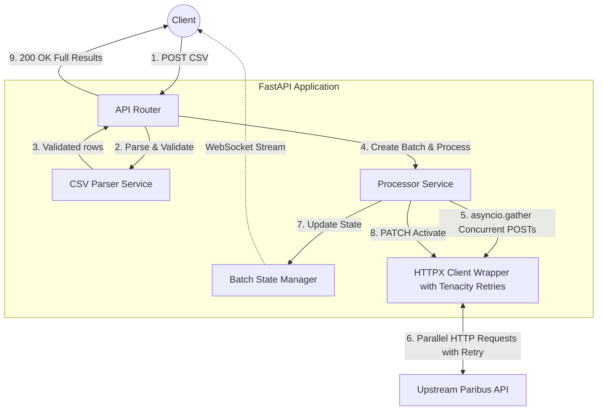

# Technical Design
**Project**: Hospital Bulk Processing System

## 1. Technology Stack
- **Language**: Python 3.11+
- **Framework**: FastAPI (async-first, Pydantic-native)
- **HTTP Client**: `httpx.AsyncClient` (async, connection-pool reuse via lifespan)
- **Resilience**: `tenacity` (exponential-backoff retries on transient upstream failures)
- **Config Management**: `pydantic-settings` (12-factor app environment handling)
- **Testing**: Pytest, pytest-asyncio, httpx (for TestClient)
- **Containerization**: Docker

---

## 2. Architectural Decisions: Synchronous vs. Asynchronous

While the system is built on an `asyncio` foundation, we chose to process the primary `/bulk` upload **synchronously** (returning the full report in the initial response) rather than using a 202-Accepted background pattern. 

### Rationale:
1. **Developer Experience**: Returning the comprehensive result immediately eliminates the need for the client to implement polling logic or complex state management to "find" the results later.
2. **Latency vs. Complexity**: With a strict constraint of 20 rows per batch, the total processing time (even with upstream latency) typically falls within the 2-5 second range. For this scale, a synchronous response is more efficient than the overhead of a multi-step background job.
3. **Reliability**: A synchronous response ensures the caller has a guaranteed "receipt" of the final state of every row in the batch.
4. **The Hybrid Model**: We provide a `background=true` query parameter for both the **Upload** and **Resume** endpoints. By default, the API is synchronous (wait for results), but clients can opt-out if they prefer a 202-Accepted background flow. This is combined with **WebSocket** tracking for real-time progress monitoring, giving developers maximum flexibility.

---

## 3. Component Architecture Diagram



---

## 3. Directory Structure & File Responsibilities

```text
paribus-hospital-bulk-processing-system/
├── app/
│   ├── __init__.py
│   ├── main.py                # App entrypoint, middleware, and exception handlers
│   ├── api/
│   │   ├── dependencies.py    # FastAPI dependency providers (DI)
│   │   └── v1/
│   │       └── hospitals.py   # Endpoint definitions (Routes only)
│   ├── core/
│   │   ├── config.py          # Pydantic BaseSettings for ENVs
│   │   ├── exceptions.py      # Custom exceptions (e.g., CSVValidationError)
│   │   └── state.py           # Simple In-Memory Batch State Manager class
│   ├── models/
│   │   ├── domain.py          # Internal data classes
│   │   └── schemas.py         # Pydantic request/response validation schemas
│   └── services/
│       ├── csv_parser.py      # DRY logic for decoding and validating CSV constraints
│       ├── hospital_client.py # HTTPX client wrapper for Upstream Paribus API
│       └── processor.py       # Orchestration logic (Bulk create, Resume)
├── docs/                      # Documentation
├── tests/
│   ├── conftest.py            # Shared Pytest fixtures
│   ├── test_api/              # Integration tests using TestClient
│   │   └── test_hospitals.py
│   └── test_services/         # Unit tests with Mocked HTTPX
│       ├── test_csv_parser.py
│       └── test_processor.py
├── Dockerfile                 # Multi-stage production build
├── docker-compose.yml         # Local development environment
├── pyproject.toml
└── requirements.txt
```

---

## 4. Internal Data Models & State Schema

### 4.1 `BatchState` Model
```python
class HospitalRowStatus(BaseModel):
    row_number: int
    payload: dict       # The raw parsed hospital data
    status: str         # "pending", "success", "failed"
    hospital_id: int | None = None
    error: str | None = None

class BatchState(BaseModel):
    batch_id: str
    status: str         # "processing", "completed", "partially_failed", "failed"
    total_rows: int
    processed_count: int = 0
    failed_count: int = 0
    batch_activated: bool = False
    processing_time_seconds: float = 0.0
    rows: list[HospitalRowStatus]
```

---

## 5. Core Services (Modularity Details)

### 5.1 `CSVParserService`
- **Responsibility**: Takes raw bytes, decodes them, and parses them into Pydantic models.
- **DRY Principle**: Utilized by both the `/bulk` and `/bulk/validate` endpoints.
- **Rules Enforced**: Max 20 rows, required columns (`name`, `address`).

### 5.2 `HospitalClient`
- **Responsibility**: Wraps `httpx.AsyncClient`. Contains specific methods for the upstream API (`create_hospital`, `activate_batch`).
- **Resilience**: Implements `@retry` via `tenacity` to handle 502/503/Timeout exceptions.

### 5.3 `BatchStateManager` (In-Memory)
- **Responsibility**: Maintains a dictionary mapping `batch_id` to `BatchState`. Enables WebSocket tracking and Resume Capability without a database.

### 5.4 `Processor`
- **Responsibility**: Orchestrates the full lifecycle of a batch. Uses `asyncio.gather` to dispatch all rows concurrently, then calls `activate_batch` upon completion.
- **Processing Time**: Records `start_time` before dispatch and stores `elapsed` in `BatchState` for the final response.

---

## 6. API Endpoints

### 6.1 `POST /api/v1/hospitals/bulk`
**Description**: Core processing endpoint. Accepts CSV, parses, concurrently creates all hospitals, activates the batch, and returns the comprehensive result.
**Request**: `multipart/form-data` containing `file` (`text/csv`).
**Response (200 OK)**:
```json
{
  "batch_id": "550e8400-e29b-41d4-a716-446655440000",
  "total_hospitals": 25,
  "processed_hospitals": 25,
  "failed_hospitals": 0,
  "processing_time_seconds": 2.5,
  "batch_activated": true,
  "hospitals": [
    {
      "row": 1,
      "hospital_id": 101,
      "name": "General Hospital",
      "status": "created_and_activated"
    }
  ]
}
```

### 6.2 `POST /api/v1/hospitals/bulk/validate`
**Description**: Validates a CSV without creating any records.
**Response (200 OK)**:
```json
{
  "is_valid": false,
  "total_rows": 15,
  "errors": [
    {"row": 3, "error": "Missing required 'address' field"}
  ]
}
```

### 6.3 `POST /api/v1/hospitals/bulk/{batch_id}/resume`
**Description**: Retries only the failed rows of a previous batch. By default, processes synchronously and returns the updated results. Supports `?background=true` for background processing.

### 6.4 `WebSocket /api/v1/hospitals/progress/{batch_id}`
**Description**: Streams live progress updates. Sends `progress_update` messages while processing, followed by a `final_result` message on completion.
```json
{"type": "progress_update", "data": {"status": "processing", "processed": 5, "failed": 0, "total": 20}}
{"type": "final_result", "data": { ... full result ... }}
```

---

## 7. Testing Strategy

### 7.1 Unit Tests (`tests/test_services/`)
- **`test_csv_parser.py`**: Validates all CSV edge cases (missing columns, >20 rows, empty rows).
- **`test_processor.py`**: Mocks `HospitalClient` to simulate successes, timeouts, and partial failures. Asserts `BatchStateManager` is updated correctly.

### 7.2 Integration Tests (`tests/test_api/`)
- Uses `fastapi.testclient.TestClient`.
- Sends mock `multipart/form-data` to the `/bulk` endpoint.
- Verifies HTTP response codes, complete JSON structure, and routing.

---

## 8. Global Error Handling Strategy

1. **`CSVValidationError`**: Raised by `CSVParserService` → Mapped to `400 Bad Request`.
2. **`UpstreamAPIError`**: Raised by `HospitalClient` after all retries fail → Mapped to `502 Bad Gateway`.
3. **`BatchNotFoundError`**: Raised when looking up a non-existent batch → Mapped to `404 Not Found`.

---

## 9. Upstream API Specifications
For the complete request/response structures, see [Upstream API Reference](./upstream_api_reference.md).
